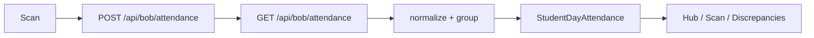

# BoB Attendance Architecture

Operational attendance for Dent Ops BoB: proactive alerts, four-punch model, payroll-safe daily rollups, and Airtable-compatible event sync — **without changing existing attendance CRUD APIs**.

## Data model (client)

Each **student-day** merges two Mongo shapes from `GET /api/bob/attendance`:

| Source | Fields | Role |
|--------|--------|------|
| **Daily rollup** | `studentId`, `podId`, `date`, `status` | Manual / payroll-safe present · absent · excused · late |
| **Punch event** (Airtable sync) | `signType`, `signInTime`, `signOutTime`, `airtableRecordId` | AM In · Lunch Out · Lunch In · PM Out |



### Punch slots

Canonical types: `am_in`, `lunch_out`, `lunch_in`, `pm_out`.

- Events with `signType` fill individual slots (Airtable-safe).
- Daily `status` fills remaining empty slots for payroll when punches are not synced yet.

### Display rule

**Never show raw Mongo ids.** All copy uses `resolveStudentName` / `resolvePodName` with loaded roster + pods.

## Layer map

```
dent-fe/src/features/bob/attendance/
  ARCHITECTURE.md
  types.ts
  model/
    buildAttendanceIndex.ts   # merge events + rollups
    computeWorkspace.ts       # alerts, discrepancies, pod/site stats
    normalizeSignType.ts      # Airtable sign type → punch slot
    resolveDisplay.ts
    constants.ts
  hooks/
    useAttendanceWorkspace.ts
  components/
    AttendanceAlertStrip.tsx  # proactive ops alerts
    AttendanceHealthBar.tsx
    DailyAttendanceTable.tsx
    PunchDots.tsx
    StudentDayDrawer.tsx      # timeline + correction
    BulkActionBar.tsx
    DiscrepancyList.tsx
    PodSiteAnalytics.tsx
  AttendanceHubPage.tsx       # dashboard + daily/week grid
  AttendanceScanPage.tsx      # fast scan + bulk + optimistic POST
  AttendanceDiscrepanciesPage.tsx
```

## Discrepancy resolution flow

1. **Detect** — `computeWorkspace` flags missing punches, missing days, late.
2. **Surface** — `AttendanceAlertStrip` on hub (e.g. “3 missing clock-ins in Phoenix Pod”).
3. **Triage** — `/app/bob/attendance/discrepancies` sorted list with pod/week filters.
4. **Resolve** — drawer or scan mode → `POST /api/bob/attendance` upsert (existing API).
5. **Invalidate** — React Query `bobKeys.attendance` + dashboard snapshot.

## Bulk action pattern

- Scan mode: row checkboxes + sticky `BulkActionBar`.
- `useUpsertBobAttendanceDay`: optimistic cache patch, then invalidate.
- “Mark all present” for whole pod in one gesture.

## Visualization strategy

| Element | Meaning |
|---------|---------|
| Green dot | Punch recorded |
| Amber dot | Late (AM or daily late) |
| Red dot | Missing punch |
| Gray dot | Excused / N/A |
| Rose dot | Absent |
| `AttendanceStatusBadge` | Day health: complete · partial · missing · late · excused · absent |

Hover tooltips on `PunchDots` show slot label + time when synced from Airtable.

## Airtable-safe sync strategy

- **Import**: one Mongo doc per Airtable row (`signType`, `airtableRecordId`) — unchanged on backend.
- **Export**: `mapMongoAttendanceToAirtableFields` — unchanged.
- **UI**: treats event rows as punches; does not overwrite event rows when setting daily `status` (separate documents).
- **Payroll**: operators use daily `status` upsert when punch log is incomplete.

## Scalability notes

- Workspace computed in-memory from list API (limit 500). Scope with `podId` + date range.
- Future: dedicated aggregation endpoint; client model stays the same.
- Dashboard `openDiscrepancies` can mirror client rules in `bobDashboardService`.

## Routes

| Path | Page |
|------|------|
| `/app/bob/attendance` | Hub — dashboard, grid, analytics |
| `/app/bob/attendance/mark` | Scan mode |
| `/app/bob/attendance/discrepancies` | Discrepancy queue |
