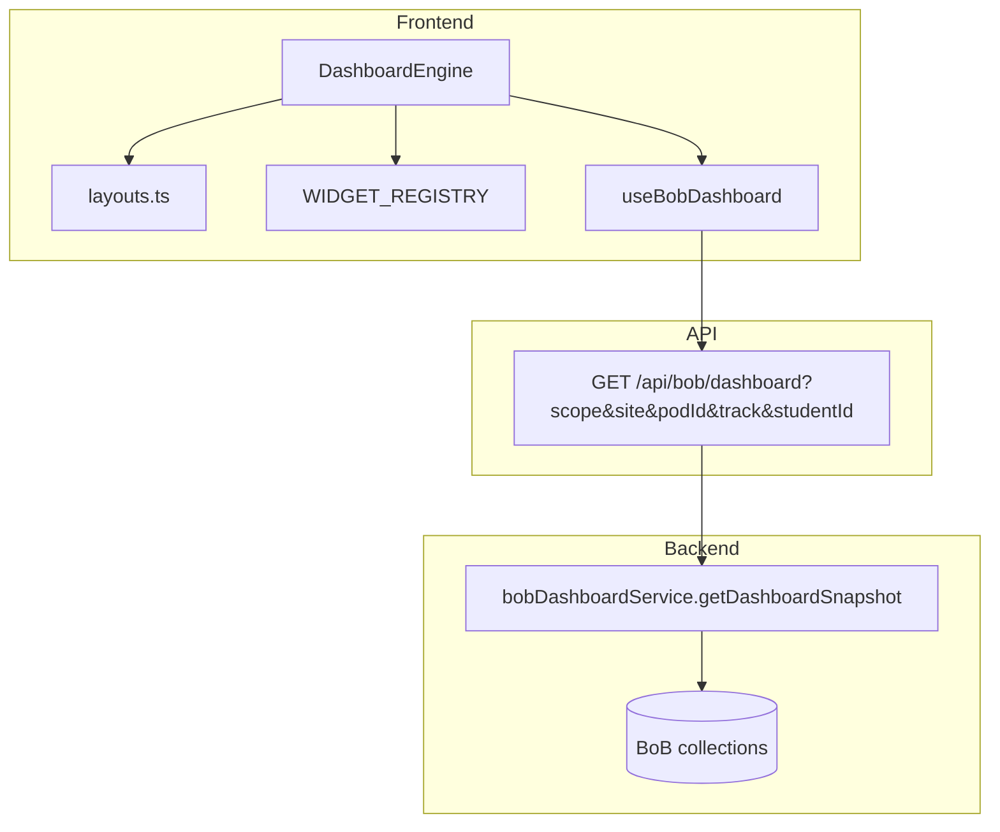

# BoB Parametric Dashboard Architecture

One operational dashboard engine for Dent Ops BoB. Every surface (command center, pod detail, student profile, site rollup) composes the **same widgets** with different **scope**, **layout**, and **role** — not separate dashboard implementations.

## Design goals

Each dashboard answers:

- **What needs attention?** → alerts, escalation banner, action queues
- **Who is blocked?** → at-risk list, onboarding summary
- **What is late?** → no-shows, wellness alerts, attention.late
- **What needs escalation?** → `attention.escalation`, high-priority queues
- **What actions are required now?** → quick actions, queue deep links

## Layered model



| Layer | Responsibility |
|-------|----------------|
| **Scope** | `organization` → `site` → `pod` → `track` → `student` + session coach filter |
| **Layout** | Config-driven sections/widgets (`config/layouts.ts`) |
| **Widget** | Presentational; reads `BobDashboardSnapshot` slice |
| **Metrics** | `METRIC_CATALOG` + `metricsToKpiItems` for KPI cards |
| **Aggregation** | Single snapshot builder on the server |

## Scope (parametric axis)

**Client** (`scope/resolveScope.ts`):

- `defaultScopeFromAccess()` — coaches → pod; site supporters → site; admins → organization
- URL params: `?scope=pod&podId=…&site=…&track=…&studentId=…`
- `scopeToApiParams()` → query string for API

**Server** (`bobDashboardService.resolveDashboardScope`):

- Merges query scope with `coachIdsFilter` from session
- Validates pod/student access for scoped users
- Auto-collapses coach session to primary pod when no query

## Metric aggregation strategy

1. **Resolve scope** → `podIds[]`, optional `studentId` / `track`
2. **Build `studentsQuery`** from scope
3. **Parallel reads**: students count/list, pods, today’s attendance
4. **Derive widgets**:
   - KPIs → `kpis` + legacy `cards`
   - Alerts → rules on no-shows, at-risk, discrepancies
   - Queues → intake, inbox, no-shows (counts from snapshot)
   - Series → `attendanceBySite`, `milestoneSubmissionByTrack`
5. **Attention rollup** → `blocked`, `late`, `escalation`

Extend aggregation by adding fields to the snapshot — widgets stay thin.

## Widget composition patterns

### Registry pattern

```tsx
// widgets/registry.tsx
export const WIDGET_REGISTRY: Record<WidgetKind, WidgetComponent> = { ... };
```

Add a widget:

1. Create `widgets/MyWidget.tsx` implementing `WidgetRenderProps`
2. Register in `WIDGET_REGISTRY`
3. Add placement in `config/layouts.ts` with optional `permissions`, `roles`, `minScope`

### Layout placement

```ts
{
  id: "today",
  title: "Today",
  columns: 2,
  widgets: [
    { id: "cc-attendance", kind: "attendance_summary", colSpan: 6 },
    { id: "cc-noshows", kind: "wellness_alerts", colSpan: 6 },
  ],
}
```

### Role-aware visibility

`config/widgets.ts` → `widgetVisible()` checks permissions (RBAC), optional roles, and `minScope`.

## Responsive grid strategy

- **KPI row**: `KpiGrid` — 2 cols mobile → 5 cols lg
- **Sections**: `DashboardGrid` — 1/2/3 columns by `section.columns`
- **Widgets**: Tailwind `colSpan` via `colSpanClass()` (6 = half width on lg)
- `grid-flow-dense` for balanced masonry-like packing

## Loading strategy

| State | UX |
|-------|-----|
| Initial load | Per-widget `DashboardWidgetSkeleton` variants |
| Background refresh | `placeholderData: (prev) => prev` + `opacity-80` on cards |
| Empty data | `DashboardEmpty` with contextual CTA |
| Scoped banner | “Updating…” when `isFetching && !isLoading` |

## Shared primitives

| Primitive | Use |
|-----------|-----|
| `MetricBarRow` | Attendance by site, milestones by track |
| `AlertBanner` / `AlertStrip` | Operational alerts |
| `DashboardCard` | Widget chrome + refresh opacity |
| `KpiGrid` (design-system) | KPI row widget |

## Implementation examples

### Command center (organization / coach pod)

```tsx
<DashboardEngine layoutId="command_center" />
```

### Pod detail (pod scope)

```tsx
<DashboardEngine
  layoutId="pod_ops"
  scope={{ level: "pod", podId: pod.id, label: pod.name }}
/>
```

Or embed `PodDashboardPanel` on pod detail page.

### Student scope (future / roster detail)

```tsx
<DashboardEngine
  layoutId="student_ops"
  scope={{ level: "student", studentId: student.id, label: student.name }}
/>
```

### Site / track drill-down

```tsx
<DashboardEngine
  scope={{ level: "site", siteName: "Harbor East" }}
/>
// or
scope={{ level: "track", track: "STEM", podId: optionalPod }}
```

## API

- **Primary**: `GET /api/bob/dashboard`
- **Legacy**: `GET /api/bob/command-center-stats` (subset, via `bobStatsService` wrapper)

## File map

```
dent-fe/src/features/bob/dashboard/
  ARCHITECTURE.md
  types.ts
  config/{layouts,metrics,widgets}.ts
  scope/resolveScope.ts
  engine/{DashboardEngine,DashboardGrid,DashboardFilters,useDashboardLayout}.tsx
  primitives/{DashboardCard,MetricBarRow,AlertBanner,...}.tsx
  widgets/{registry,+ widget components}.tsx
  PodDashboardPanel.tsx

dent-be/services/bobDashboardService.js
```

## Next extensions

- Wire real intake/inbox counts into `queues`
- Student onboarding tasks in `onboarding_summary`
- WebSocket or polling for “real-time” queue counts
- Track-level layout on milestones page with `scope.track`
